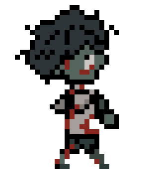

# Syncopate Machine v1.0.0

Tiny grouped-attention Q policies for tactical zombie game AI.

<p align="center">
  
</p>

This repo is the **model side only** for my Godot/Rust zombie-AI experiments.
The full game source is not here. What is here is the small Rust trainer, the
selected checkpoints, clean result tables, and the paper-facing artifact.

No giant model. No fake AGI perfume. Just a tiny policy asking a painful indie
question:

> when does a small game stop wanting more if-else rules and start wanting a
> learned tactical controller?

## Paper and Demo

Paper draft:

[Syncopate Machine v1.0.0](paper-results/Syncopate%20Machine%20v1.0.0.pdf)

Demo video:

[YouTube demo](https://youtu.be/UGRb-PfT5CQ?si=FmYV-yOfVVga3x5x)

The paper is intentionally fair. The learned model is dangerous, but the
upgraded rule expert is still slightly faster on pure kill speed. That matters.
If a handcrafted rule is already sharp, you do not throw it away just because
the word "attention" looks cooler in a PDF.

## Model Name

**Syncopate Machine v1.0.0**

Current public checkpoint: **2k grouped-attention entity decoder**.

Internal checkpoint `model_type` is still `tiny_q_attention_v1` because the
Godot/Rust runtime uses that protocol string to load the weights. The public
model name is Syncopate Machine v1.0.0.

## What The Model Does

Syncopate Machine does **not** control raw movement.

Godot still owns:

- path execution
- collision
- animation
- cooldowns
- facing
- hit validation
- damage

The zombie model only chooses high-level tactical positioning actions for each
live zombie:

```text
PATH_FRONT
PATH_LEFT
PATH_RIGHT
PATH_BACK
DASH_UP
DASH_DOWN
DASH_LEFT
DASH_RIGHT
```

There is no zombie `ATTACK` action anymore. Zombie attack is an execution
policy: if the zombie is close enough, facing the player, cooldown-ready, and
the dot-product cone passes, the normal game attack state fires automatically.

The player Q-policy keeps 16 actions, but its two attack actions are now
attack-while-move actions:

```text
ATTACK_WHILE_MOVE_1_COMBO
ATTACK_WHILE_MOVE_2_COMBOS
```

Those actions move and face toward the target zombie before striking. Combo 2
queues a delayed follow-up instead of spamming two attack requests in the same
frame.

## Architecture

Input is one global player token plus up to five zombie entity tokens:

```text
global:  player_x, player_y, stuck_x, stuck_y, stamina, attacking, hp, zombie_count
entity:  zombie_x, zombie_y, stuck_x, stuck_y, hp, attack_cd, dash_cd, distance_to_player
```

Pipeline:

```text
entity tokens
-> feature projection
-> role / type embedding
-> RoPE
-> grouped-attention decoder block
-> per-entity Q heads
-> Q(zombie_i, action)
```

The selected checkpoint:

| Model | Zombie params | Player params | dt | Max episode |
| --- | ---: | ---: | ---: | ---: |
| Syncopate Machine v1.0.0 | 1,900 | 2,084 | 0.10s | 60s |

The Rust runtime also uses a small draft/verify path:

1. A cheap role heuristic drafts a path-slot action.
2. The Q head verifies it.
3. If the draft is close enough to the Q argmax, use it.
4. Otherwise reject it and use the Q argmax.

This borrows the shape of speculative decoding, but it is adapted for Q-values.
It is not probability-correct language-model speculative decoding.

## Latest Results

Held-out comparison, 256 episodes, armed Q-player:

| Controller | Win rate | Mean TTK | Zombie reward | Action entropy | Score |
| --- | ---: | ---: | ---: | ---: | ---: |
| Rule expert with dash-in/out | 1.000 | 1.160s | 33.912 | 0.700 | 106.132 |
| Syncopate Machine v1.0.0 | 1.000 | 1.194s | 34.094 | 0.686 | 106.002 |

The rule expert is now fairer: if close, it may dash in before the automatic
attack; if the player is attacking, it may dash out. That baseline is nasty,
and it still wins TTK by a hair. Good. That is the honest result.

Capacity sweep at `dt=0.10`:

| Budget | Zombie params | Player params | Win | TTK | Entropy | Score | Latency |
| --- | ---: | ---: | ---: | ---: | ---: | ---: | ---: |
| 1k | 968 | 1,104 | 1.000 | 1.120s | 0.623 | 105.506 | 22.544us |
| 2k | 1,900 | 2,084 | 1.000 | 1.163s | 0.695 | 106.099 | 24.460us |
| 4k | 3,968 | 4,264 | 1.000 | 1.342s | 0.295 | 102.764 | 47.020us |
| 8k | 7,808 | 8,232 | 1.000 | 1.830s | 0.751 | 105.962 | 43.050us |
| 10k | 10,208 | 10,696 | 1.000 | 2.227s | 0.732 | 105.372 | 52.011us |

The 2k model is the selected point right now: tiny, fast, and the best mixed
score in the sweep.

## Files

```text
src/bin/train_entity_decoder_selfplay.rs
checkpoints/syncopate_machine_v1_0_0_zombie_policy.json
checkpoints/syncopate_machine_v1_0_0_player_policy.json
checkpoints/zombie_policy_final.json
checkpoints/player_policy_final.json
paper-results/Syncopate Machine v1.0.0.pdf
paper-results/*.csv
arts/zombie_1_move_sample.gif
arts/zombie_1_body.png
arts/zombie_1_hand.png
```

## Quick Start

Run tests:

```powershell
cargo test
```

Run a small self-play training pass:

```powershell
cargo run --release --bin train_entity_decoder_selfplay -- --episodes=500 --dt=0.1 --episode-seconds=60
```

Run a rule-expert comparison from a checkpoint folder:

```powershell
cargo run --release --bin train_entity_decoder_selfplay -- --compare-rule-expert=true --resume=true --dt=0.1 --episode-seconds=60 --output-dir=checkpoints --eval-episodes=64
```

Run the 1k-10k sweep:

```powershell
cargo run --release --bin train_entity_decoder_selfplay -- --sweep-capacity=true --sweep-max-target=10000 --episodes=500 --dt=0.1 --episode-seconds=60
```

## What This Is Not

This is not a full game-AI framework.

This is not end-to-end learned movement.

This is not proof that neural AI beats handcrafted rules.

It is a small, honest model-side artifact for studying when tiny learned
tactical policies become worth the extra work in a small game.
